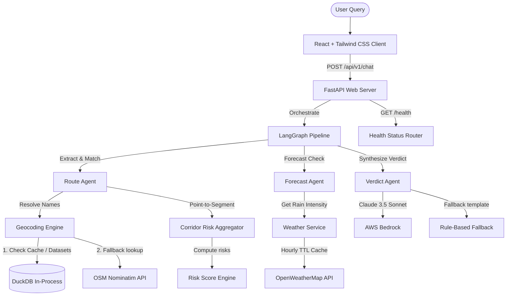

# FloodCast Gurugram

**FloodCast Gurugram** is a decision-intelligence tool that answers one specific question no existing map or reporting tool answers: 

> *"Given the current rainfall forecast, will my route through Gurugram be risky in the next few hours — and when exactly?"*

This is **not** a static hotspot map (anyone can already Google the famous flood-prone chowks) and **not** a citizen-reporting tool (MCG already runs one). The entire value of this product is the forward-looking, time-windowed, route-level risk verdict.

---

## ⚠️ Data Honesty: What's Real vs. Synthetic?

This project maintains strict data honesty. The dataset is a deliberate mix of confirmed-real and synthetic elements, which is traceably visible in the backend API and frontend UI.

For full methodologies, consult [DATA_PROVENANCE.md](file:///Users/adarsh/Desktop/floodcast-gurugram/backend/data/DATA_PROVENANCE.md).

### What's Real (Confirmed Facts)
- **Total Hotspot Count**: 64 total hotspots (36 base official locations + 28 expanded locations).
- **Landmark Attractions**: 8 landmark POIs (Cyber Hub, Ambience Mall, etc.). They have no severity tiers or risk fields (they are never merged with flood hotspots).
- **Location Names**: Locations are based on news archives (Tribune, NewsX, Business Standard) and MCG's Zone 1 pre-monsoon classification list.

### What's Synthetic (Engineering Estimates)
- **Coordinates**: Coordinates for all hotspots are **approximate and uncorroborated** (best-effort placements based on general network layout).
- **Risk Model Columns**: The following parameters are **entirely fabricated** for testing dynamic behaviors:
  - `rainfall_threshold_mm_per_hr` (15–55 mm/hr depending on severity tier)
  - `time_to_flood_after_threshold_min` (20–150 min)
  - `typical_drain_time_hr` (0.5–6.0 hours)
  - `drainage_capacity_score` (0.10–0.85)

*A user or official looking at this tool can always tell which data is sourced fact and which is an engineering estimate via visual border/color differences on the map and badges in the chat responses.*

---

## 🛣️ Routing Disclosures
- **Straight-Line Corridor matching**: Route flood risk is computed by identifying hotspots that fall within a configurable buffer distance of a **straight line** segment between the resolved origin and destination.
- **No Turn-by-Turn engine**: There is **no** turn-by-turn routing engine. The system is designed to identify hazards along a corridor, not provide driving navigation. This heuristic is disclosed prominently in all route verdicts.

---

## 🏗️ Architecture



---

## ⚙️ Environment Variables Setup

Create a `.env` file in the `backend/` directory based on the variables below:

```bash
# --- OpenWeatherMap API ---
OPENWEATHERMAP_API_KEY=your_openweathermap_api_key_here

# --- AWS Credentials for Bedrock ---
AWS_ACCESS_KEY_ID=your_aws_access_key_id_here
AWS_SECRET_ACCESS_KEY=your_aws_secret_access_key_here
AWS_REGION=us-east-1

# --- Claude Bedrock Models ---
BEDROCK_HAIKU_MODEL_ID=anthropic.claude-3-5-haiku-20241022-v1:0
BEDROCK_SONNET_MODEL_ID=anthropic.claude-sonnet-4-20250514-v1:0

# --- Allowed CORS Origins ---
ALLOWED_ORIGINS=http://localhost:5173,https://your-vercel-frontend-domain.vercel.app
```

---

## 🏃 Running Locally

### 1. Backend (FastAPI)
```bash
cd backend
python3 -m venv venv
source venv/bin/activate
pip install -r requirements.txt
uvicorn app.main:app --reload
```
API Documentation will be live at: `http://localhost:8000/docs`
Uptime health status is at: `http://localhost:8000/health`

### 2. Frontend (React + TypeScript)
In a separate terminal:
```bash
cd frontend
npm install
# Set API URL
echo "VITE_API_BASE_URL=http://localhost:8000" > .env.local
npm run dev
```
Open `http://localhost:5173` in your browser.

---

## 📊 Dataset Regeneration

If you modify or expand the underlying reference data, regenerate the parquet files using the generator scripts:

```bash
cd backend
python3 data/generate_hotspots.py
python3 data/generate_expansion.py
```
*Note: The generator seeds are fixed (42 for base, 43 for expansion) to guarantee reproducible outputs.*

---

## 🚀 Deployment

### Backend (Render)
1. Commit and push the codebase to GitHub.
2. Link your repository to Render.
3. Select **Web Service** with the runtime set to **Docker** (Render will auto-detect the `Dockerfile`).
4. Set the Environment Variables (`OPENWEATHERMAP_API_KEY`, `AWS_ACCESS_KEY_ID`, `AWS_SECRET_ACCESS_KEY`, etc.) in the Render dashboard.
5. Provide `/health` as the Health Check Path. Render will poll this to verify successful builds and keep the server warm.

### Frontend (Vercel)
1. Add a project in Vercel linked to the repository.
2. Set the Root Directory to `frontend`.
3. Add the build-time environment variable:
   `VITE_API_BASE_URL` pointing to your deployed Render URL (e.g. `https://your-service.onrender.com`).
4. Click **Deploy**. Vercel will automatically configure the build output using the `vercel.json` rewrites.
