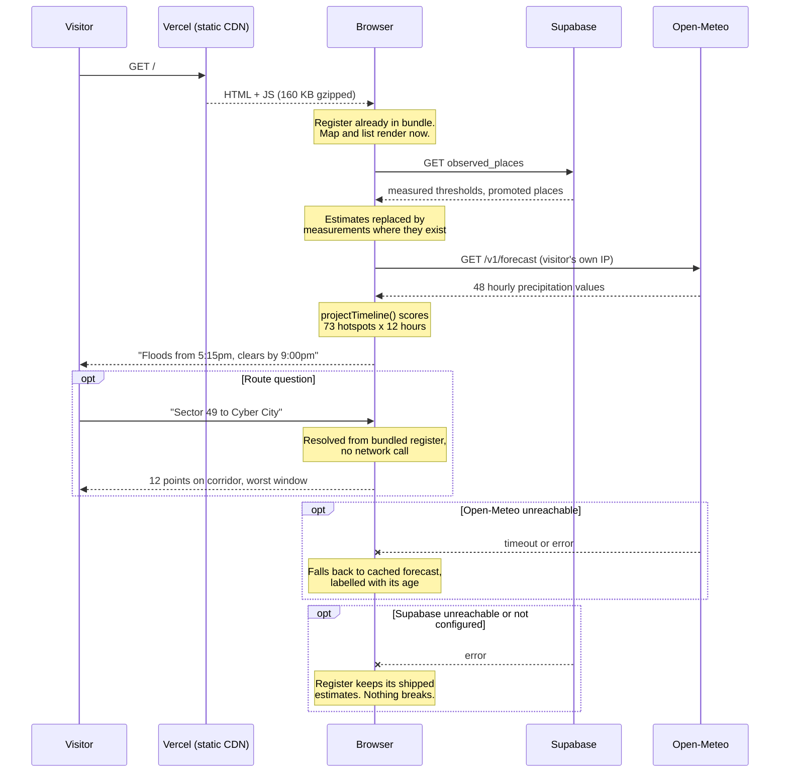

# Floodcast-Gurugram

**Given the live rainfall forecast, will my route through Gurugram be risky in the next few hours, and when exactly?**

[](https://github.com/adarshcod30/Floodcast-Gurugram/actions/workflows/ci.yml)
[](https://floodcast-gurugram.vercel.app)
[](https://floodcast-gurugram.vercel.app)
[](LICENSE)

**Live: https://floodcast-gurugram.vercel.app**

`flood-forecasting` `gurugram` `gurgaon` `monsoon` `urban-flooding` `civic-tech`
`disaster-preparedness` `open-meteo` `supabase` `react` `typescript` `leaflet`
`pwa` `offline-first` `open-data` `data-provenance`

---

## Why this exists

I lived in Gurugram from June to August, on an internship.

I arrived expecting the commute to be the boring part of the day. It was not. The
monsoon here does not arrive as weather, it arrives as logistics. One badly timed
hour of rain and a fifteen-minute stretch of road becomes a two-hour decision you
have already got wrong by the time you are standing in it.

The 2026 season was a bad one even by the city's standards. A 97mm day that put old
Gurugram under water. Then 225mm across 8 and 9 August, after which the Municipal
Corporation said it had identified 155 waterlogging-prone points across the city.
Then 75mm on 24 August, which was enough for a citywide work-from-home advisory and
for schoolchildren to sit in stationary buses for three to six hours.

What struck me was not that it flooded. Everyone knows Gurugram floods, and everyone
can name the same four or five chowks. What struck me was that on any given evening,
standing at a window with rain coming down, I still could not answer the only question
that actually mattered:

> **Should I leave now, or wait?**

There was plenty of information. There was a weather app telling me millimetres. There
were lists of flood-prone spots. There was Twitter, after the fact. None of it composed
into an answer, because all of it was missing the same ingredient: **time**. "Iffco Chowk
floods" is not an answer. "Iffco Chowk floods from about 5:15pm and clears by about 9:00pm,
so leave before 5 and you miss it" is an answer.

So I built the thing I wanted to have had. It takes the live hourly rainfall forecast,
runs it against a register of Gurugram's flood points that I researched and sourced one
row at a time, and gives a verdict with a clock attached. A risk score with no time on it
cannot answer "should I leave now", so this system never produces one.

Then it does one more thing, which matters more than the forecasting. **Every one of those
thresholds started as an educated guess**, because nobody publishes the real ones. So the
app learns them: a person photographs real water at a real place, the app looks up the rain
that actually fell there beforehand, and after the same spot has been seen flooding on two
separate days it starts scoring that place against what was measured instead of what was
guessed. The register is not a fixed list any more. It gets less wrong every monsoon.

---

## What it does

| | |
|---|---|
| **Asks the right question** | Not "where floods" but "will my route flood, when does it start, when does it clear" |
| **Runs entirely in your browser** | No server to wake up, no API key, nothing to go down at 2am |
| **Says what it does not know** | Every number is labelled sourced, measured, or estimated, on a tab of its own |
| **Learns from the people using it** | Citizen reports promote new flood points and replace guessed thresholds with measured ones |
| **Works when the network does not** | Installable PWA, register precached, last good forecast cached and labelled with its age |

### Features

| Feature | What it does |
|---|---|
| **Time-windowed risk** | Compares live hourly rainfall against each of 73 points and computes when it floods and when it clears |
| **Route verdicts** | Resolves two place names, finds hotspots along the corridor between them, returns the worst point and the worst window |
| **Hourly timeline** | Scrub forward through the forecast and watch the map, verdict and register re-read at that hour |
| **Provenance on every point** | Marker fill encodes certainty, so a placeholder never renders like an MCG-named hotspot |
| **Rainfall simulator** | Gurugram is dry most of the year. Ask what happens at 20, 35 or 55 mm/hr and watch the register respond, using the same engine as the live verdict |
| **Citizen reports** | Camera photo, GPS fix with its accuracy, and a depth. Saved on the device first so a failed upload never loses it, and reviewed before anyone else sees it |
| **A register that learns** | Reports within 500 m are one place. A place reported three times across two separate days becomes a flood point in its own right, drawn with its own provenance and never merged into the researched 73 |
| **Thresholds measured from reports** | Every approved report gets the rainfall that fell before it attached. A place seen flooded on two separate days publishes the lightest rain that did it, and the model scores it against that number instead of the estimate |
| **Moderation that the database enforces** | A review queue and a places screen behind a real login, where row level security and column grants decide what is allowed, not the interface |
| **CPCB National AQI** | The 0-500 scale Indian residents and officials actually use, computed from a 24-hour pollutant mean, not a vendor's 1-5 index |

---

## Read this first: what is real and what is not

This project treats data honesty as a product requirement, not a disclaimer. The
distinction below is visible on the map, in the register, and on a dedicated
**What's real** tab in the app, not buried in a CSV column.

### The register: 39 of 73 points are sourced

| Count | Tier | What it means |
|---:|---|---|
| **4** | `confirmed_named_mcg_zone1` | Named directly in MCG's own Zone 1 hotspot list |
| **26** | `confirmed_named_multi_source` | A recurring waterlogging point in two or more independent news reports, 2022 to 2025 |
| **9** | `confirmed_named_2026_monsoon` | Named by a dated, on-record institutional source from the current season: GMDA's CEO by name, or a specific enumerated Tribune list |
| **24** | `plausible_real_unconfirmed_flood_status` | A real Gurugram locality on low ground or near a bad corridor. **No source confirms it floods.** A watchlist, not a finding |
| **10** | `reconstructed_estimate` | Not found named in any source. Present only to preserve MCG's official 36-point count. **A placeholder, not a fact** |

**Do not quote "73 hotspots" as though it carried the weight of "36 hotspots", or as a
claim to match MCG's 155.** Expanding the register diluted average confidence relative to
the original 36 (72% sourced), even though this round's nine additions are all sourced.
That trade-off is documented rather than hidden.

None of the official counts agree with each other either. MCG's 155, GMDA's own 6-point
"vulnerable spots" list, a separate 40-site chronic-sewer list, and a 28-point list the
Tribune enumerated all measure different things, from different agencies, at different
dates. See [`docs/DATA_PROVENANCE.md`](docs/DATA_PROVENANCE.md) section 9 for the full
reconciliation, or rather the lack of one.

### One measured thing, and what it showed

Every hotspot carries the catchment area that drains through it, taken from GMDA's own
published drainage network (4,701 mapped stream segments, 10 watersheds). That is the
first non-estimated physical fact in the register, and it is shown in each map popup.

It is **not** used in any risk score, and a test enforces that. It also produced an
uncomfortable result worth stating up front: median catchment by severity tier comes out
at 0.653, 0.663 and 0.698 sq km for hypercritical, moderate and minor. Flat, and slightly
backwards. GMDA's hydrology shows no relationship with the tiers this register assigns.

That may mean Gurugram floods from blocked drains rather than big catchments, which is
what local reporting describes, or it may mean the tiers do not measure a physical
property. The one point with an exceptional catchment, Hero Honda Chowk at 9.5 sq km, is
also the one that reliably makes national news. Full discussion in
[`docs/GMDA_DATA.md`](docs/GMDA_DATA.md).

### Every coordinate is approximate

No geocoding API placed these points. They are best-effort positions from Gurugram's
sector layout and road network. `coordinates_verified` is `No` for all 73 rows, on
purpose, as a standing reminder.
[`scripts/verify_coordinates.py`](scripts/verify_coordinates.py) audits them against
OpenStreetMap and writes a review report ([`docs/COORDINATE_AUDIT.md`](docs/COORDINATE_AUDIT.md)).
It never edits the data.

### Route risk is straight-line corridor matching, not routing

The system draws the direct line between origin and destination and finds hotspots within
a 1.5 km buffer of it. **Your actual drive may follow entirely different roads.** There is
no turn-by-turn routing engine here. This is a deliberate, disclosed simplification,
stated in every route answer the app gives.

---

## The model, and how it stops being a guess

### Where the numbers came from

Four columns drive every risk score: `rainfall_threshold_mm_per_hr`,
`time_to_flood_after_threshold_min`, `typical_drain_time_hr`, and
`drainage_capacity_score`. All four shipped as **engineering estimates**, assigned by
severity tier, with no historical rainfall-versus-flood record behind them. The scoring
logic is sound and tested; the inputs were not measurements.

| Tier | Rainfall threshold | Time to flood | Drain time | Drainage score |
|---|---|---|---|---|
| Hypercritical | 15 to 22 mm/hr | 20 to 40 min | 3.0 to 6.0 hr | 0.10 to 0.30 |
| Moderate | 25 to 35 mm/hr | 40 to 90 min | 1.5 to 3.0 hr | 0.35 to 0.60 |
| Minor | 40 to 55 mm/hr | 90 to 150 min | 0.5 to 1.5 hr | 0.65 to 0.85 |

Earlier versions of this file said that gap closes the day GMDA shares historical
flood-report data. That was wrong, or at least incomplete. **A citizen report already
carries half the pair**: a place, a time, and an observed depth. Open-Meteo supplies the
other half, the rainfall that actually fell at that coordinate in the hours before. Put
them together and the tool generates its own calibration data without waiting for anybody.

### The learning loop

```mermaid
flowchart LR
    R["Citizen report<br/>place, time, depth, photo"] --> M{"Moderator<br/>approves?"}
    M -->|no| X["Rejected.<br/>Nothing changes."]
    M -->|yes| C["Cluster within 500 m<br/>into one place"]
    C --> OM["Open-Meteo:<br/>rain in the 6 hours before"]
    OM --> P["(rainfall to depth) pair<br/>stored on the report"]

    C --> PR{"3 reports across<br/>2 separate days?"}
    PR -->|yes| NEW["Promoted: a flood point<br/>in its own right"]
    PR -->|not yet| WAIT["Gathering"]

    P --> CAL{"Knee deep or worse,<br/>over 1 mm/hr,<br/>on 2 separate days?"}
    CAL -->|yes| TH["Publish the lightest rain<br/>ever seen to flood it"]
    CAL -->|not yet| WAIT2["Pairs counted,<br/>no number claimed"]

    TH --> SCORE["Register point within 500 m<br/>is scored against the<br/>measured number from now on"]

    style NEW fill:#1a1a2e,stroke:#E2701B
    style TH fill:#0d2818,stroke:#2E9E63
    style SCORE fill:#0d2818,stroke:#2E9E63
```



Three rules, each stated in the app itself and each living in exactly one function so the
code, the docs and the interface cannot drift apart:

| Rule | Value | Why that value |
|---|---|---|
| Reports are the same place within | **500 m** | Nobody stands in the exact same puddle twice. Two reports 80 m apart are one problem, not two pins |
| A place is promoted after | **3 reports across 2 separate days** | The day count does the work. Four reports during one storm are four people describing one event; three reports on three days are a place that floods |
| A threshold is published after | **2 separate days at knee deep or worse, with over 1 mm/hr of rain behind it** | Ankle-deep water is a puddle in a bad kerb. Water with no rain behind it is a burst main or a blocked drain, which is real and worth reporting and says nothing about a rainfall threshold |

A promoted place is drawn on the map as a flood point in its own right, with a dashed ring
marking its provenance, and is **never merged into the 73 researched rows**. A measured
threshold replaces its hotspot's estimate in the scoring from then on, and is labelled
`measured` everywhere it appears.

What gets published is deliberately a weak claim: the **lightest rain ever actually seen to
flood that place**. That is a floor, not a fitted curve, and it drops further if a lighter
storm ever floods the place again. A regression through four points would be false
precision wearing the costume of rigour.

The rules live in [`supabase/schema.sql`](supabase/schema.sql)
(`report_cluster_radius_m`, `promotion_rule`, `calibration_rule`,
`refresh_observed_place`) and the browser half in
[`frontend/src/lib/engine/calibration.ts`](frontend/src/lib/engine/calibration.ts).

### What a moderator can and cannot do

The review screen has two tabs: a queue that decides what the public sees, and a **Places**
tab showing every spot the reports have found, what it is doing to the model, and the
reports behind it. A moderator can name a place, tie it to a register point, or hide one
that turns out to be junk. Hiding sits on top of the promotion rule rather than replacing
it, so restoring a place brings back whatever its reports actually support.

What a moderator explicitly **cannot** do is type in a measurement. `report_count`,
`calibration_pairs` and `observed_threshold_mm_hr` are writable only by the database
trigger, enforced by column grants:

```sql
revoke update on public.observed_places from anon, authenticated;
grant update (label, hotspot_id, suppressed, suppressed_reason)
  on public.observed_places to authenticated;
```

Row level security decides which **rows**; only column grants decide which **columns**.
Without that second line a signed-in moderator could PATCH a threshold straight through
PostgREST and manufacture a measurement nobody observed. So a number marked `measured` on
this map is always something people actually stood in.

**Deleting, as distinct from hiding.** Hiding is reversible and keeps the evidence, which
is right for a place that might come back. It is wrong for a photograph that should not be
stored at all, so a moderator can also delete a report or an entire place outright.

Deletion is deliberately **not** a `DELETE` policy. The tables still grant `DELETE` to
nobody, so a leaked publishable key cannot erase what anybody reported. It goes through a
function that demands an allowlisted moderator, demands a reason of at least three
characters, and writes the whole row into `moderation_deletions` before removing it. A
deletion that leaves no trace of what was deleted is indistinguishable from one that never
happened. The photo goes first, through the Storage API from the moderator's own browser,
because Supabase refuses direct SQL deletes on storage and doing it in that order means a
crash between the two steps leaves a visible broken report rather than an invisible
orphaned photograph of somebody's street.

### One report per place, per six hours

Rate limiting here is scoped to **(browser, place)** rather than to a global count.
Somebody walking home past three flooded roads should file three reports and be thanked
for it. What is worthless is the same person reporting the same puddle repeatedly.

| | |
|---|---|
| Different places, same browser | Always allowed |
| Same place, within 6 hours, same or shallower | **Refused**, with the reason and what to do instead |
| Same place, within 6 hours, **deeper** | Allowed. Water getting worse is the most useful thing anyone can report |
| No browser id at all | Refused, so the limit is not optional for whoever reads this source |

**This is a civility limit and not a security control**, and the difference matters.
`device_id` identifies a browser, not a person: there is no login for reporters, on purpose,
because requiring an account to say "this road is under water" would lose most of the
reports worth having. Clearing site data, a private window, or posting straight to the API
with a random uuid all get a fresh id. It stops a double-tapped submit button and casual
repetition. Moderation is what stops anyone determined, and nothing in the interface
pretends otherwise.

Note that spamming one place could never force a promotion anyway: the rule counts
**distinct days**, so twenty reports in one afternoon are still one day.

---

## Architecture

```mermaid
flowchart TB
    subgraph build ["Build time (CI)"]
        GEN["4 Python generators<br/>fixed seeds"]
        CSV["hotspots_extended.csv<br/>73 sourced rows"]
        JSON["hotspots.json<br/>bundled, 62 KB"]
        GEN --> CSV --> JSON
    end

    subgraph device ["Runtime (the visitor's browser)"]
        RISK["risk.ts<br/>time-windowed scoring"]
        ROUTE["route.ts<br/>corridor matching"]
        PLACES["places.ts<br/>name resolution"]
        AQI["aqi.ts<br/>CPCB National AQI"]
        CALIB["calibration.ts<br/>folds measurements<br/>into the register"]
        UI["React + Leaflet"]
    end

    subgraph shared ["Optional shared layer (Supabase)"]
        DB[("reports<br/>observed_places")]
        RULES["clustering, promotion<br/>and calibration<br/>in SQL triggers"]
        DB --- RULES
    end

    OM["Open-Meteo<br/>keyless, CORS: *"]
    NOM["Nominatim<br/>fallback only"]

    JSON --> CALIB --> RISK
    OM -->|"hourly mm/hr"| RISK
    OM -->|"pollutants"| AQI
    OM -->|"rain before a report"| DB
    DB -->|"measured thresholds"| CALIB
    RISK --> ROUTE --> UI
    RISK --> UI
    AQI --> UI
    PLACES -.->|"only if not in register"| NOM
    PLACES --> ROUTE

    style device fill:#0d2818,stroke:#2d6a4f
    style build fill:#1a1a2e,stroke:#3d3d5c
    style shared fill:#2a1a1a,stroke:#6a3d3d
```



**In plain language:** the register is baked into the JavaScript bundle at build time, so
the map and the list are on screen before any network request happens. The only always-on
call is to Open-Meteo for hourly rainfall, made straight from the visitor's browser.
Everything else, the scoring, the corridor matching, the AQI, the place lookup, runs on the
device. Nominatim is touched only when someone asks about a place that is not already in the
register. Supabase is optional: without it the app is a complete, working forecast tool and
the report tab stores to the device only.

### Request flow, first paint to verdict



### It opens instantly, and it cannot go down

The app is a static site. There is no server to run, no API key, and nothing to keep alive.

That is a deliberate correction, not a shortcut. The previous version put a FastAPI service
on a free-tier container between the browser and the data, and it failed in two ways at once:

| | Before | Now |
|---|---|---|
| First load, cold | **42.7 seconds** | **under 1 second** |
| Rainfall in production | **permanently broken** (HTTP 429) | live |
| Things that can fail at 2am | container, API, weather proxy | none |
| Hosting cost | free tier that sleeps | free static hosting |

The 42 seconds was a sleeping container waking up. To anyone arriving cold, the site simply
did not load. The 429 was subtler and worse: every forecast request left from one shared
cloud IP, which Open-Meteo rate limits, so the deployed site sat on a permanent rate-limit
error with **no rainfall data at all**, which is the entire point of the product.

Neither problem was fixable in the frontend, because both were caused by having a server in
the path. Nothing the backend did actually needed one:

- The hotspot register is **62 KB of static rows**, so it ships inside the bundle.
- The risk scoring is **pure arithmetic** over those rows, so it runs on the device.
- Open-Meteo needs **no key** and sends `access-control-allow-origin: *`, so the browser
  calls it directly, from the visitor's own IP, where a per-IP rate limit is never approached.

The whole app, including all 73 hotspots and the map library, is **160 KB gzipped**.

---

## The data pipeline

There is no trained model here, and saying so plainly matters more than dressing the
project up as machine learning. What exists is a sourced dataset, a deterministic scoring
function, and a calibration loop that replaces estimates with measurements as evidence
arrives. Each stage below is a script anybody can rerun.

### 1. Collection

| Source | What came from it | How |
|---|---|---|
| MCG Zone 1 official hotspot list | 4 named points, and the 36-row structure the register preserves | Public reporting, transcribed by hand |
| News coverage 2022 to 2025 (Tribune, HT, TOI, Hindustan Times) | 26 multi-source points | Read, cross-referenced, a point kept only when two independent reports named it |
| GMDA CEO statements and Tribune's 2026 enumerated list | 9 current-season points | Dated, on-record, attributed by name |
| GMDA OneMap ArcGIS REST service | 4,701 drainage segments, 10 watersheds | [`data/fetch_gmda_drainage.py`](data/fetch_gmda_drainage.py), which handles the server's legacy TLS renegotiation |
| Open-Meteo forecast and air-quality APIs | Hourly rainfall, pollutant concentrations | Called live from the browser, never stored |
| Citizen reports | Place, time, observed depth, photo | The app itself, moderated before anything is public |

### 2. Cleaning and structuring

- Every row carries a `data_confidence` tier and a `source_note` naming where it came from.
  A point without a source does not get a confident tier, it gets the watchlist tier or the
  placeholder tier.
- Coordinates are best-effort placements from the locality clusters the sources describe,
  and every row is flagged `coordinates_verified = No`.
  [`scripts/verify_coordinates.py`](scripts/verify_coordinates.py) measures each against
  OpenStreetMap and writes a review report without ever editing the data.
- Duplicates are resolved by name and locality across stages, so "Khandsa Road" from the
  2022 coverage and "Khandsa Chowk" from GMDA's 2026 list stay one row.

### 3. Transformation, four deterministic stages

Run from the repository root, in this order. Fixed seeds, so the output is reproducible.

```bash
pip install pandas pyarrow
python3 data/generate_hotspots.py             # stage 1: 36 rows, MCG structure, frozen
python3 data/generate_expansion.py            # stage 2: 36 -> 64 rows
python3 data/generate_2026_monsoon_update.py  # stage 3: 64 -> 73 rows
python3 data/export_to_frontend.py            # stage 4: emits the JSON the app ships
python3 scripts/check_data_integrity.py       # every format agrees
```

Stage 1 is deliberately frozen: it reproduces MCG's official pre-monsoon classification as
it stood, and editing it would make that snapshot untraceable. New findings are additive.

**Edit the generators, never the CSVs.** A hand-edited CSV drifts from its generator and the
next regeneration silently discards the correction. CI regenerates all four stages on every
push and fails if the result differs from what is committed.

### 4. Scoring, which is arithmetic and not inference

For each hotspot and each forecast hour: if intensity is below the threshold, risk is zero
and the app says so. At or above it, the time to flood shortens with intensity (roughly 30%
faster at twice the threshold), the episode duration is derived from how long rainfall stays
above a floor, and the clearing time comes from the drain time. Output is a risk level on the
IMD warning bands plus an explicit window: starts at, clears by.

### 5. Evaluation, and what it can and cannot tell you

There is no accuracy figure here, because there is no ground-truth flood log to score
against. Claiming one would be the exact dishonesty this project exists to avoid. What can
be stated:

- **Response curve** (the shipped engine, measured on the deployed site): 10 mm/hr floods
  nothing, 20 mm/hr takes out the 10 worst chowks, 35 mm/hr reaches 44 of 73 points, and
  55 mm/hr sustained takes the whole register. That progression matches how the city behaves
  in a monsoon burst, and a test fails if the curve ever goes flat or all-or-nothing.
- **Sourcing rate**: 39 of 73 points (53%) are backed by a named source, up from 30 of 64
  (47%) before the 2026 round.
- **Hydrological corroboration**: none. GMDA's catchment areas do not correlate with the
  severity tiers, and that negative result is published rather than buried.
- **Calibration progress**: measured thresholds and the pairs behind them are counted live
  on the What's real tab. On a quiet week that reads zero, which is the honest answer.

---

## Tech stack

| Layer | Choice | Why |
|---|---|---|
| UI | React 19 + TypeScript | Strict types across the data contract |
| Build | Vite 8 (rolldown) | 160 KB gzipped total output, sub-second builds |
| Map | Leaflet + react-leaflet | Canvas rendering for 73+ markers, no API key |
| Rainfall | [Open-Meteo](https://open-meteo.com) | Keyless, CORS-enabled, **hourly** resolution |
| Air quality | Open-Meteo air-quality API | Feeds a CPCB computation done in-app |
| Geocoding | Bundled register, then [Nominatim](https://nominatim.openstreetmap.org) | Local first, network only as fallback |
| Shared reports | Supabase (Postgres, PostgREST, Storage, GoTrue) | Row level security is the enforcement, not the client |
| Offline | vite-plugin-pwa (Workbox) | Precached shell and register, CacheFirst map tiles |
| Data pipeline | Python + pandas + pyarrow | Four generators, fixed seeds, reproducible |
| Tests | Vitest | 51 tests over scoring, geometry, parsing, AQI and calibration |
| Lint | oxlint | Fast enough to run on every save |
| Hosting | Vercel static | No runtime, nothing to wake |
| CI | GitHub Actions | Lint, test, build, and data reproducibility on every push |

**Why Open-Meteo and not OpenWeatherMap:** OWM's free tier returns 3-hour buckets.
Averaging a 12mm cloudburst across three hours yields 4mm/hr, which is under the flooding
threshold of *every* hypercritical point in the register. Short, intense bursts are exactly
what floods Gurugram, and exactly what averaging hides. Open-Meteo reports precipitation per
hour, so a one-hour window's millimetre figure is already the mm/hr intensity the risk
engine wants, with no division and no smearing.

### Where the logic lives

| File | Responsibility |
|---|---|
| [`lib/engine/risk.ts`](frontend/src/lib/engine/risk.ts) | Time-windowed scoring. **The single most important file** |
| [`lib/engine/calibration.ts`](frontend/src/lib/engine/calibration.ts) | Rainfall lookup behind a report, and matching a measured place onto the register |
| [`lib/engine/weather.ts`](frontend/src/lib/engine/weather.ts) | Open-Meteo client, caching, stale-but-labelled fallback |
| [`lib/engine/route.ts`](frontend/src/lib/engine/route.ts) | Haversine, point-to-segment distance, corridor matching |
| [`lib/engine/places.ts`](frontend/src/lib/engine/places.ts) | Register-first name resolution, Nominatim fallback |
| [`lib/engine/aqi.ts`](frontend/src/lib/engine/aqi.ts) | CPCB National AQI from pollutant concentrations |
| [`lib/store.ts`](frontend/src/lib/store.ts) | Assembles a snapshot, holds the calibrated register, answers questions |
| [`lib/reports/`](frontend/src/lib/reports/) | Device queue, photo preparation, PostgREST client |
| [`supabase/schema.sql`](supabase/schema.sql) | Tables, policies, triggers, grants. The rules that outlive the UI |
| [`data/*.py`](data/) | Four-stage generator chain producing the register |

There is exactly **one** implementation of the scoring. The previous design kept it
server-side specifically so a second implementation could not drift from the first. That
reasoning still holds, which is why this was a move rather than a copy: there is no Python
copy left to disagree with `risk.ts`.

---

## Quick start

```bash
git clone https://github.com/adarshcod30/Floodcast-Gurugram.git
cd Floodcast-Gurugram/frontend
npm install
npm run dev
```

Open http://localhost:5173. That is the entire setup. No keys, no `.env`, no services, no
accounts. The forecast, the map, the register, the route answers and the simulator all work
immediately.

```bash
npm test         # 51 tests, no network, no keys
npm run lint     # oxlint
npm run build    # tsc -b && vite build
```

### Optional: switching on shared reports

Without this the Report tab still works. The camera and GPS capture normally, everything is
stored on the device, nothing is uploaded, and the interface says so. To let reports be
shared between people:

1. Create a free project at [supabase.com](https://supabase.com).
2. Run [`supabase/schema.sql`](supabase/schema.sql) in its SQL editor. That creates the
   tables, the storage bucket, the row level security policies, the clustering and
   calibration triggers, and the column grants.
3. Put the project URL and publishable key in `frontend/.env.local` (see
   [`.env.example`](frontend/.env.example)), and in your Vercel project's environment
   variables for production.
4. Create a moderator account under **Authentication → Users**, then **add it to the
   allowlist**, which is what actually grants the permission:
   ```sql
   insert into public.moderators (user_id, email)
   select id, email from auth.users where email = 'you@example.com';
   ```
5. Review submissions from the **Review queue** button in the sidebar, or at `/#moderate`.

Step 4 is two steps deliberately. Supabase allows public email signup by default, so
"signed in" only means "owns an email address". Moderation is gated on that allowlist table
rather than on merely holding an account, so it holds even if signup stays open or an OAuth
provider is added later.

The publishable key is public by design and safe in the bundle. See
[SECURITY.md](SECURITY.md) for the full capability matrix of what that key can and cannot
do, verified against the live API rather than assumed. Never ship the `service_role` key,
which bypasses every policy.

---

## Testing

```bash
cd frontend && npm test
```

51 tests. They assert product invariants, not status codes:

- Any nonzero risk **always** carries a time window, because a risk number with no time
  cannot answer "should I leave now"
- Every timestamp carries a timezone offset, because a naive timestamp silently shifts every
  window by 5.5 hours for an IST user
- `data_confidence` is present and valid on all 73 rows, because a placeholder rendering
  like an MCG-named hotspot is the specific dishonesty this project exists to prevent
- Landmarks never carry a risk field, because scoring one would state a flood claim about a
  shopping mall
- Drizzle cannot chain into a multi-day flood episode, a real bug this floor was added to fix
- An unavailable AQI is reported as unavailable rather than invented, per CPCB's
  minimum-data rule
- One sector number never resolves to a different one, a real bug where "Sector 49" matched
  "Sector 45"
- The simulator's response curve rises with intensity and is neither flat nor
  all-or-nothing, because a curve that did not discriminate would tell a resident nothing
- A measured threshold actually rescores its hotspot, and reverts when the measurement is
  withdrawn, because the calibration loop is worthless if it only changes a label
- The browser's 500 m matching radius equals the database's clustering radius, because if
  those two numbers ever drift a report can calibrate a point it never clustered into

CI additionally **regenerates the register from the generators and fails if the result
differs from what is committed**, so the data the app ships is always traceable to the
sourcing recorded in `docs/DATA_PROVENANCE.md`.

---

## Deployment and infrastructure

| | |
|---|---|
| **Hosting** | Vercel static. Root directory `frontend`, framework preset Vite |
| **Routing** | [`frontend/vercel.json`](frontend/vercel.json) supplies the SPA rewrite and immutable asset caching |
| **Environments** | Production on `main`. Preview deployments on every pull request |
| **CD** | Push to `main` deploys. No build secrets, no environment variable is required for the core app |
| **CI** | [`.github/workflows/ci.yml`](.github/workflows/ci.yml): lint, test, type-check and build, plus a data job that regenerates the register and fails on any drift |
| **Shared layer** | Supabase free tier. Optional: the app is fully functional without it |
| **Monitoring** | None, deliberately. There is no runtime to monitor. The forecast source is labelled live, cached or unavailable in the interface itself, which is where a user needs it |

Any static host works, because the build output is just files:

```bash
cd frontend && npm run build   # produces dist/
```

---

## Project structure

```
Floodcast-Gurugram/
├── .github/
│   ├── workflows/ci.yml              Lint, test, build, data reproducibility
│   ├── ISSUE_TEMPLATE/               Bug, data correction, feature request
│   └── PULL_REQUEST_TEMPLATE.md      Includes a provenance checklist
├── data/                             The register and how it is produced
│   ├── generate_hotspots.py          Stage 1: 36-row official-structure base, frozen
│   ├── generate_expansion.py         Stage 2: reads base, writes 64 rows
│   ├── generate_2026_monsoon_update.py  Stage 3: writes 73 rows
│   ├── export_to_frontend.py         Stage 4: emits the JSON the app ships
│   ├── fetch_gmda_drainage.py        GMDA OneMap ArcGIS fetch, legacy TLS handled
│   ├── hotspots_extended.csv         The register, 73 rows
│   └── gmda/                         Fetched drainage network, raw
├── docs/
│   ├── DATA_PROVENANCE.md            Every source, every caveat, every count that did not reconcile
│   ├── GMDA_DATA.md                  The drainage dataset and what it did not corroborate
│   ├── COORDINATE_AUDIT.md           Generated review report, never auto-applied
│   └── ORIGINAL_BRIEF.md             The brief this started from, kept as history
├── frontend/
│   ├── src/
│   │   ├── data/                     Generated JSON, committed
│   │   ├── lib/engine/               Scoring, weather, routing, places, AQI, calibration
│   │   ├── lib/reports/              Device queue, photo prep, PostgREST client
│   │   ├── lib/store.ts              Snapshot assembly, calibrated register, Q&A
│   │   └── components/               Verdict, timeline, map, register, ask, report, moderation
│   ├── .env.production               URL and publishable key, committed on purpose
│   └── vercel.json                   SPA rewrite and asset caching
├── scripts/
│   ├── verify_coordinates.py         Coordinate audit, never auto-edits
│   ├── check_data_integrity.py       Every format agrees on the data
│   └── make_icons.py                 PWA icon generation
├── supabase/schema.sql               Tables, RLS, triggers, grants. Run this to enable sharing
├── CONTRIBUTING.md                   Including the one rule that outranks style
├── SECURITY.md                       What the public key can do, verified
└── CODE_OF_CONDUCT.md
```

---

## Prior art: this does not exist in a vacuum

**[FloodWatch Gurgaon](https://floodwatchgurgaon.in)** is an independent, volunteer-built
project covering 700+ areas with a static "Monsoon Readiness Score" (0-100, from elevation,
drainage and historical incidents) and a rain simulator for hypothetical scenarios. It also
uses Open-Meteo. The mechanism differs from this project's: MRS is a per-area
seasonal-readiness score you check once, while this tool reads the *live* forecast and
answers a *route*, with an explicit time window, on demand. Neither makes the other
redundant. FloodWatch's complaint-email and ward-contact tooling is a genuine feature this
project does not have.

**GMDA runs a 24x7 Flood Control Office**, a real-time monitoring room rather than a
predictive tool, with a public helpline: **1800-180-1817** or **0124-4753555**. This project
cannot make the city deploy a pump or clear a drain. If a verdict here says a route is
critical, that is the number to call, and it is surfaced in the app rather than left for the
user to go and find.

---

## Known limitations

Stated plainly, because a tool that overstates its confidence is worse than no tool:

1. **Most of the model is still uncalibrated.** Thresholds and drain times are tier-based
   estimates until reports measure them. Treat every timing as directional.
2. **34 of 73 points are unconfirmed or placeholder.** Filter to sourced-only on the map to
   see just the 39 backed by a named source.
3. **Coordinates are approximate.** A pin means "this junction, roughly", never a survey
   position.
4. **Routes are straight-line corridors,** not turn-by-turn.
5. **Forecast, not observation.** No rain gauge feeds this. It reasons about what a weather
   model predicts, which is not what is happening on the road right now.
6. **Report counts measure attention, not severity.** A busy road full of commuters with
   phones will out-report a worse but quieter road, which is why count drives confidence
   here and never colour.
7. **A camera photo is a signal, not proof.** `capture` is a hint browsers may ignore and
   EXIF is editable. Moderation is what decides, and the app never claims otherwise.
8. **The report limit identifies a browser, not a person.** It stops accidental and casual
   repetition. It does not stop anyone who clears their storage.
9. **Rainfall is one input among several.** Drain blockage, upstream release and
   construction all cause flooding this model cannot see.

## Roadmap

- [x] Installable PWA with offline register access
- [x] Citizen reports with camera, GPS and moderation
- [x] Clustering, promotion and self-calibration from reports
- [x] Moderation screen for places, with database-enforced limits on it
- [ ] Enough real reports through a monsoon to publish a measured threshold on a
      researched point
- [ ] Derive `drainage_capacity_score` from GMDA's published flow network instead of
      severity tier. The data is public: 4,701 stream segments with per-segment catchment areas
- [ ] Verify the three coordinates the audit flagged (IFFCO Chowk, Rajiv Chowk, Sector 10A)
- [x] Rate-limit reports per browser per place, so one road cannot be spammed while
      reporting many roads stays easy
- [x] Delete a report or a place outright, with a reason kept on the record
- [ ] Rate-limit at the edge as well, by IP. PostgREST does not expose the client address
      to a policy, so this needs an edge function in front of the insert
- [ ] Per-user saved routes, so the daily commute is one tap
- [ ] Ward-level contacts, so a verdict can end in an action and not just a warning

---

## For evaluators at MCG / GMDA

- **The register is auditable.** Every point carries its provenance tier and source note,
  from the CSV through to the interface. Nothing claims more confidence than its source
  supports.
- **Nothing is fabricated.** An earlier version served invented power outages, roadworks and
  transit status as if live. All of it was deleted rather than relabelled.
- **The synthetic layer is isolated and swappable.** Four documented columns hold every
  estimate. Given historical rainfall-versus-flood-report data, replacing them is a data
  update: the scoring, interface and structure stay as they are.
- **It degrades predictably.** With no forecast at all, the register and its thresholds still
  render, clearly marked as unscored. That matters because a flood tool is needed most when
  its dependencies are least reliable.
- **It already collects the missing dataset.** Every approved citizen report is stored with
  the rainfall that preceded it. That is the rainfall-versus-flood pair this project has
  always said it lacked, and it accumulates whether or not anyone shares an archive.

The most valuable thing GMDA could contribute is historical rainfall-versus-flood-report
pairs for even a handful of hypercritical points. That single dataset converts this from a
plausible model into a calibrated one overnight rather than over seasons.

---

## Contributing

Issues and pull requests are welcome. Read [CONTRIBUTING.md](CONTRIBUTING.md) first, because
one rule outranks every style preference here: **never present an estimate as a
measurement**. Two practical consequences:

1. **Never add a hotspot without a source.** If it cannot be cited, it belongs in the
   watchlist tier or nowhere.
2. **Edit the generators, not the CSVs.** CI will catch the difference.

If you live in Gurugram and know a road that floods, the most useful contribution is not a
pull request at all. Open the app, use the Report tab, and photograph it next time it
happens. Three reports across two days put it on the map permanently.

Security issues: please report privately, see [SECURITY.md](SECURITY.md).

## Credits and licence

Rainfall and air quality from [Open-Meteo](https://open-meteo.com) (CC-BY 4.0). Map tiles
from [OpenStreetMap](https://www.openstreetmap.org/copyright) contributors. Geocoding
fallback via [Nominatim](https://nominatim.openstreetmap.org). Drainage network from
[GMDA OneMap](https://onemapdepts.gmda.gov.in). Warning colours follow the
[India Meteorological Department](https://mausam.imd.gov.in) scheme. Hotspot classification
derived from MCG and GMDA public reporting and independent news coverage, 2022 to 2026. See
[`docs/DATA_PROVENANCE.md`](docs/DATA_PROVENANCE.md) for every source.

Built by [Adarsh Dwivedi](https://github.com/adarshcod30).

Licensed under the [MIT Licence](LICENSE). [NOTICE.md](NOTICE.md) states in
plain language what the numbers in this tool are, what they are not, and why it
must not be the sole basis for a safety decision.
