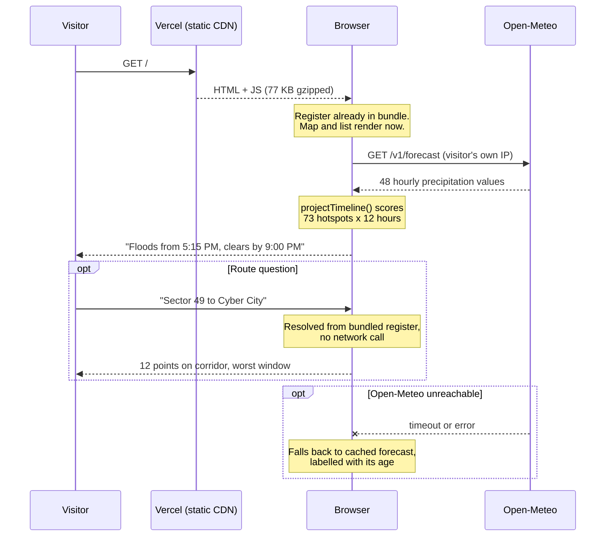

# FloodCast Gurugram

**Given the current rainfall forecast, will my route through Gurugram be risky in the next few hours, and when exactly?**

**Live: https://floodcast-gurugram-adarshcod30s-projects.vercel.app**

That question is the whole product. Not a hotspot map (anyone can already Google the famous flood-prone chowks), and not a citizen-reporting tool (MCG already runs one). The value is the forward-looking, time-windowed, route-level verdict: not *"Iffco Chowk floods"* but *"Iffco Chowk floods from about 5:15 PM and clears by about 9:00 PM, so leave before 5 and you miss it."*

A risk score with no time attached is not an answer to *"should I leave now"*, so this system never produces one.

`flood-forecasting` `gurugram` `monsoon` `urban-flooding` `open-meteo` `react` `typescript` `leaflet` `civic-tech` `offline-first`

---

## It opens instantly, and it cannot go down

The app is a static site. There is no server, no database, no API key, and nothing to keep running.

That is a deliberate correction, not a shortcut. The previous version put a FastAPI service on a free-tier container between the browser and the data, and it failed in two ways at once:

| | Before | Now |
|---|---|---|
| First load, cold | **42.7 seconds** | **under 1 second** |
| Rainfall in production | **permanently broken** (HTTP 429) | live |
| Things that can fail at 2am | container, API, weather proxy | none |
| Hosting cost | free tier that sleeps | free static hosting |

The 42 seconds was a sleeping container waking up. To anyone arriving cold, the site simply did not load. The 429 was subtler and worse: every forecast request left from one shared cloud IP, which Open-Meteo rate limits, so the deployed site sat on a permanent rate-limit error with **no rainfall data at all**, which is the entire point of the product.

Neither problem was fixable in the frontend, because both were caused by having a server in the path. Nothing the backend did actually needed one:

- The hotspot register is **22 KB of static rows**, so it ships inside the bundle.
- The risk scoring is **pure arithmetic** over those rows, so it runs on the device.
- Open-Meteo needs **no key** and sends `access-control-allow-origin: *`, so the browser calls it directly, from the visitor's own IP, where a per-IP rate limit is never approached.

The whole app, including all 73 hotspots and the map library, is **77 KB gzipped**.

---

## Read this first: what is real and what is not

This project treats data honesty as a product requirement, not a disclaimer. The distinction below is visible on the map, in the register, and on a dedicated **"What's real"** tab in the app, not buried in a CSV column.

### This monsoon

Gurugram had a severe 2026 season: a 97mm-in-a-day event that left old Gurugram worst hit, an 8 to 9 August event of **225mm over two days**, after which MCG's Commissioner said the city had identified **155 waterlogging-prone points**, and a **75mm day on 24 August** that triggered a citywide work-from-home advisory, stranding schoolchildren in buses for 3 to 6 hours ([The Tribune](https://www.tribuneindia.com/news/gurugram/gurugram-drowns-again-millennium-citys-poshest-mile-goes-under-forces-wfh-order-for-aug-25/), [New Kerala/ANI](https://www.newkerala.com/news/a/gurugram-identifies-155-waterlogging-prone-points-municipal-corporation-gurugram-984.htm)).

None of the official counts agree with each other. MCG's 155, GMDA's own 6-point "vulnerable spots" list, a separate 40-site chronic-sewer list, and a 28-point list the Tribune enumerated all measure different things, from different agencies, at different dates. This register does not claim to match any of them. See [`DATA_PROVENANCE.md`](data/DATA_PROVENANCE.md) section 9 for the full reconciliation, or the lack of one.

### The hotspot register: 39 of 73 points are sourced

| Count | Tier | What it means |
|---:|---|---|
| **4** | `confirmed_named_mcg_zone1` | Named directly in MCG's own Zone 1 hotspot list |
| **26** | `confirmed_named_multi_source` | A recurring waterlogging point in two or more independent news reports, 2022 to 2025 |
| **9** | `confirmed_named_2026_monsoon` | Named by a dated, on-record institutional source from the *current* season: GMDA's CEO by name, or a specific enumerated Tribune list |
| **24** | `plausible_real_unconfirmed_flood_status` | A real Gurugram locality on low ground or near a bad corridor. **No source confirms it floods.** A watchlist, not a finding |
| **10** | `reconstructed_estimate` | Not found named in any source. Present only to preserve MCG's official 36-point count. **A placeholder, not a fact** |

**Do not quote "73 hotspots" as though it carries the weight of "36 hotspots", or as a claim to match MCG's 155.** Expanding the register diluted average confidence relative to the original 36 (72% sourced), even though this round's nine additions are all sourced. That trade-off is documented rather than hidden.

### The risk model is calibrated, not measured

Four columns drive every risk score: `rainfall_threshold_mm_per_hr`, `time_to_flood_after_threshold_min`, `typical_drain_time_hr`, and `drainage_capacity_score`. **All four are engineering estimates**, set by severity tier, with no historical rainfall-versus-flood record behind them.

The scoring *logic* is sound and tested. The *inputs* are not measurements. This is precisely the piece that becomes real the day GMDA shares historical flood-report data, and the schema is deliberately shaped so that swapping in calibrated values is a data update, not a rewrite.

### Every coordinate is approximate

No geocoding API placed these points. They are best-effort positions from Gurugram's sector layout and road network. `coordinates_verified` is `No` for all 73 rows, on purpose, as a standing reminder. [`scripts/verify_coordinates.py`](scripts/verify_coordinates.py) audits them against OpenStreetMap and writes a review report. It never edits the data.

### Route risk is straight-line corridor matching, not routing

The system draws the direct line between origin and destination and finds hotspots within a 1.5 km buffer of it. **Your actual drive may follow entirely different roads.** There is no turn-by-turn routing engine here. This is a deliberate, disclosed simplification, stated in every route answer the app gives.

Full methodology: [`data/DATA_PROVENANCE.md`](data/DATA_PROVENANCE.md).

---

## Features

| Feature | What it does |
|---|---|
| **Time-windowed risk** | Compares live hourly rainfall against each of 73 points and computes when it floods and when it clears |
| **Route verdicts** | Resolves two place names, finds hotspots along the corridor between them, returns the worst point and worst window |
| **Hourly timeline** | Scrub forward through the forecast and watch the map, verdict and register re-read at that hour |
| **Provenance on every point** | Marker fill encodes certainty, so a placeholder never renders like an MCG-named hotspot |
| **Rainfall simulator** | Gurugram is dry most of the year. Ask what happens at 20, 35 or 55 mm/hr and watch the register respond, using the same engine as the live verdict |
| **Citizen reports** | Camera photo, GPS fix with its accuracy, and a depth. Saved on the device first so a failed upload never loses it, and reviewed before anyone else sees it |
| **Installable, works offline** | A real PWA. The register is precached, so it opens and draws all 73 points with no connection |
| **CPCB National AQI** | The 0-500 scale Indian residents and officials actually use, computed from a 24-hour pollutant mean, not a vendor's 1-5 index |
| **Works on a bad connection** | The register is in the bundle, and the last good forecast is cached, so a failed fetch degrades to stale-but-labelled rather than blank |

### Tech stack

| Layer | Choice | Why |
|---|---|---|
| UI | React 19 + TypeScript | Strict types across the data contract |
| Build | Vite 8 | 77 KB gzipped total output |
| Map | Leaflet + react-leaflet | Canvas rendering for 73 markers, no API key |
| Rainfall | [Open-Meteo](https://open-meteo.com) | Keyless, CORS-enabled, **hourly** resolution |
| Air quality | Open-Meteo air-quality API | Feeds a CPCB computation done in-app |
| Geocoding | Bundled register, then [Nominatim](https://nominatim.openstreetmap.org) | Local first, network only as fallback |
| Data pipeline | Python + pandas | Four generators, fixed seeds, byte-reproducible |
| Tests | Vitest | 38 tests over scoring, geometry, parsing and AQI |
| Hosting | Vercel static | No runtime, nothing to wake |

**Why Open-Meteo and not OpenWeatherMap:** OWM's free tier returns 3-hour buckets. Averaging a 12mm cloudburst across three hours yields 4mm/hr, which is under the flooding threshold of *every* hypercritical point in the register. Short, intense bursts are exactly what floods Gurugram, and exactly what averaging hides. Open-Meteo reports precipitation per hour, so a one-hour window's millimetre figure is already the mm/hr intensity the risk engine wants, with no division and no smearing.

---

## Architecture

```mermaid
flowchart TB
    subgraph build ["Build time (CI)"]
        CSV["hotspots_extended.csv<br/>73 sourced rows"]
        GEN["4 Python generators<br/>fixed seeds"]
        JSON["hotspots.json<br/>bundled, 22 KB"]
        GEN --> CSV --> JSON
    end

    subgraph device ["Runtime (the visitor's browser)"]
        RISK["risk.ts<br/>time-windowed scoring"]
        ROUTE["route.ts<br/>corridor matching"]
        PLACES["places.ts<br/>name resolution"]
        AQI["aqi.ts<br/>CPCB National AQI"]
        UI["React + Leaflet"]
    end

    OM["Open-Meteo<br/>keyless, CORS: *"]
    NOM["Nominatim<br/>fallback only"]

    JSON --> RISK
    OM -->|"hourly mm/hr"| RISK
    OM -->|"pollutants"| AQI
    RISK --> ROUTE --> UI
    RISK --> UI
    AQI --> UI
    PLACES -.->|"only if not in register"| NOM
    PLACES --> ROUTE

    style device fill:#0d2818,stroke:#2d6a4f
    style build fill:#1a1a2e,stroke:#3d3d5c
```



**In plain language:** the register is baked into the JavaScript bundle at build time, so the map and the list are on screen before any network request happens. The only live call is to Open-Meteo for hourly rainfall, made straight from the visitor's browser. Everything else, the scoring, the corridor matching, the AQI, the place lookup, runs on the device. Nominatim is touched only when someone asks about a place that is not already in the register.

### Request flow, first paint to verdict



### Where the logic lives

| File | Responsibility |
|---|---|
| [`lib/engine/risk.ts`](frontend/src/lib/engine/risk.ts) | Time-windowed scoring. **The single most important file** |
| [`lib/engine/weather.ts`](frontend/src/lib/engine/weather.ts) | Open-Meteo client, caching, stale-but-labelled fallback |
| [`lib/engine/route.ts`](frontend/src/lib/engine/route.ts) | Haversine, point-to-segment distance, corridor matching |
| [`lib/engine/places.ts`](frontend/src/lib/engine/places.ts) | Register-first name resolution, Nominatim fallback |
| [`lib/engine/aqi.ts`](frontend/src/lib/engine/aqi.ts) | CPCB National AQI from pollutant concentrations |
| [`lib/store.ts`](frontend/src/lib/store.ts) | Assembles a snapshot, answers questions |
| [`data/*.py`](data/) | Four-stage generator chain producing the register |

There is exactly **one** implementation of the scoring. The previous design kept it server-side specifically so a second implementation could not drift from the first. That reasoning still holds, which is why this was a move rather than a copy: there is no Python copy left to disagree with `risk.ts`.

---

## Quick start

```bash
git clone https://github.com/adarshcod30/floodcast-gurugram.git
cd floodcast-gurugram/frontend
npm install
npm run dev
```

Open http://localhost:5173. That is the entire setup. No keys, no `.env`, no services, no accounts.

### Switching on shared reports (optional)

Without this, the Report tab still works: the camera and GPS capture normally
and everything is stored on the device. Nothing is uploaded, and the UI says
so. To let reports be shared:

1. Create a free project at [supabase.com](https://supabase.com)
2. Run [`supabase/schema.sql`](supabase/schema.sql) in its SQL editor. This creates the table, the storage bucket, and the row level security policies that do the actual enforcing
3. Put the project URL and anon key in `frontend/.env.local` (see [`.env.example`](frontend/.env.example)), and in your Vercel project's environment variables for production
4. Create a moderator account under Authentication, then review submissions at `/#moderate`

The anon key is public by design and safe in the bundle. An anonymous
visitor can only ever insert a `pending` report and only ever read `approved`
ones, and that is enforced in Postgres rather than in the client. Never ship
the `service_role` key, which bypasses every policy.

```bash
npm test         # 38 tests
npm run lint
npm run build    # type-check and production build
```

---

## Project structure

```
floodcast-gurugram/
├── data/                          The register and how it is produced
│   ├── generate_hotspots.py       Stage 1: 36-row official-structure base
│   ├── generate_expansion.py      Stage 2: reads base, writes 64 rows
│   ├── generate_2026_monsoon_update.py  Stage 3: writes 73 rows
│   ├── export_to_frontend.py      Stage 4: emits the JSON the app ships
│   ├── hotspots_extended.csv      The register, 73 rows
│   └── DATA_PROVENANCE.md         Every source, every caveat
├── frontend/
│   └── src/
│       ├── data/                  Generated JSON, committed
│       ├── lib/engine/            Scoring, weather, routing, places, AQI
│       ├── lib/store.ts           Snapshot assembly and question answering
│       └── components/            Verdict, timeline, map, register, ask, about
├── scripts/verify_coordinates.py  Coordinate audit, never auto-edits
└── .github/workflows/ci.yml       Lint, test, build, data reproducibility
```

---

## Testing

```bash
cd frontend && npm test
```

The suite asserts product invariants, not status codes:

- Any nonzero risk **always** carries a time window, because a risk number with no time cannot answer "should I leave now"
- Every timestamp carries a timezone offset, because a naive timestamp silently shifts every window by 5.5 hours for an IST user
- `data_confidence` is present and valid on all 73 rows, because a placeholder rendering like an MCG-named hotspot is the specific dishonesty this project exists to prevent
- Landmarks never carry a risk field, because scoring one would state a flood claim about a shopping mall
- Drizzle cannot chain into a multi-day flood episode, a real bug this floor was added to fix
- An unavailable AQI is reported as unavailable rather than invented, per CPCB's minimum-data rule
- One sector number never resolves to a different one, a real bug where "Sector 49" matched "Sector 45"
- The simulator's response curve rises with intensity and is neither flat nor all-or-nothing, because a curve that did not discriminate would tell a resident nothing

For the record, that curve today reads: 10 mm/hr floods nothing, 20 mm/hr takes out the 10 worst chowks, 35 mm/hr reaches 44 of 73 points, and 55 mm/hr sustained takes the whole register. That progression matches how the city actually behaves in a monsoon burst.

CI additionally **regenerates the register from the generators and fails if the result differs from what is committed**, so the data the app ships is always traceable to the sourcing recorded in `DATA_PROVENANCE.md`.

---

## Deployment

Any static host works, because the build output is just files.

```bash
cd frontend && npm run build   # produces dist/
```

Currently on Vercel: root directory `frontend`, framework preset Vite, and [`vercel.json`](frontend/vercel.json) supplies the SPA rewrite. Pushing to `main` deploys. There is no environment variable to set and no backend to point at.

### Regenerating the datasets

Run from the repository root. All generators use fixed seeds, so output is byte-identical across runs.

```bash
pip install pandas pyarrow
python3 data/generate_hotspots.py
python3 data/generate_expansion.py
python3 data/generate_2026_monsoon_update.py
python3 data/export_to_frontend.py
```

**Edit the generators, never the CSVs.** A hand-edited CSV drifts from its generator, and the next regeneration silently discards the correction.

---

## Prior art: this does not exist in a vacuum

**[FloodWatch Gurgaon](https://floodwatchgurgaon.in)** is an independent, volunteer-built project covering 700+ areas with a static "Monsoon Readiness Score" (0-100, from elevation, drainage and historical incidents) and a rain simulator for hypothetical scenarios. It also uses Open-Meteo. The mechanism differs from this project's: MRS is a per-area seasonal-readiness score you check once, while this tool reads the *live* forecast and answers a *route*, with an explicit time window, on demand. Neither makes the other redundant. FloodWatch's complaint-email and ward-contact tooling is a genuine feature this project does not have.

**GMDA runs a 24x7 Flood Control Office**, a real-time monitoring room rather than a predictive tool, with a public helpline: **1800-180-1817** or **0124-4753555**. This project cannot make the city deploy a pump or clear a drain. If a verdict here says a route is critical, that is the number to call, and it is surfaced in the app rather than left for the user to go find.

---

## Known limitations

Stated plainly, because a tool that overstates its confidence is worse than no tool:

1. **The risk model is uncalibrated.** Thresholds and drain times are tier-based estimates. Treat every timing as directional.
2. **34 of 73 points are unconfirmed or placeholder.** Filter to sourced-only on the map to see just the 39 backed by a named source.
3. **Coordinates are approximate.** A pin means "this junction, roughly", never a survey position.
4. **Routes are straight-line corridors,** not turn-by-turn.
5. **Forecast, not observation.** No rain gauge feeds this. It reasons about what a weather model predicts, which is not what is happening on the road right now.
6. **Rainfall is one input among several.** Drain blockage, upstream release and construction all cause flooding this model cannot see.

## Roadmap

- [x] Installable PWA with offline register access
- [x] Citizen reports with camera, GPS and moderation
- [ ] Calibrate the four synthetic columns against real rainfall-versus-flood-report pairs. See [`docs/GMDA_DATA.md`](docs/GMDA_DATA.md) for exactly which dataset does this and how to ask for it
- [ ] Derive `drainage_capacity_score` from GMDA's published flow network instead of severity tier. The data is public: 4,701 stream segments with per-segment catchment areas
- [ ] Verify the three coordinates the audit flagged (IFFCO Chowk, Rajiv Chowk, Sector 10A)
- [ ] Rate-limit report submission at the edge. Today abuse is bounded by moderation and a 1 MB cap, not by a limiter
- [ ] Per-user saved routes, so the daily commute is one tap

---

## For evaluators at MCG / GMDA

- **The register is auditable.** Every point carries its provenance tier and source note, from the CSV through to the UI. Nothing claims more confidence than its source supports.
- **Nothing is fabricated.** An earlier version served invented power outages, roadworks and transit status as if live. All of it was deleted rather than relabelled.
- **The synthetic layer is isolated and swappable.** Four documented columns hold every estimate. Given historical rainfall-versus-flood-report data, replacing them is a data update: the scoring, UI and structure stay as they are.
- **It degrades predictably.** With no forecast at all, the register and its thresholds still render, clearly marked as unscored. That matters because a flood tool is needed most when its dependencies are least reliable.

The most valuable thing GMDA could contribute is historical rainfall-versus-flood-report pairs for even a handful of hypercritical points. That single dataset converts this from a plausible model into a calibrated one.

---

## Contributing

Issues and pull requests are welcome. Two rules matter more than style:

1. **Never add a hotspot without a source.** If it cannot be cited, it belongs in the watchlist tier or nowhere.
2. **Edit the generators, not the CSVs.** CI will catch the difference.

## Credits and licence

Rainfall and air quality from [Open-Meteo](https://open-meteo.com) (CC-BY 4.0). Map tiles from [OpenStreetMap](https://www.openstreetmap.org/copyright) contributors. Geocoding fallback via [Nominatim](https://nominatim.openstreetmap.org). Warning colours follow the [India Meteorological Department](https://mausam.imd.gov.in) scheme. Hotspot classification derived from MCG and GMDA public reporting and independent news coverage, 2022 to 2026. See [`DATA_PROVENANCE.md`](data/DATA_PROVENANCE.md) for every source.

MIT.
